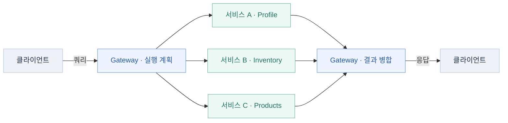

# BFF와 마이크로서비스를 연결하는 GraphQL Federation: Apollo의 역할과 트레이드오프

내 정보를 조회하는 화면을 만든다고 가정해 보자. 프로필만 필요한 화면도 있고, 내 Inventory와 그 안의 상품 정보까지 필요한 화면도 있다. Profile·Inventory·Products가 각각 다른 서비스에 있다면, 화면마다 서비스별 요청과 데이터 조합 코드를 작성해야 할까?

Apollo Federation에서는 클라이언트가 하나의 GraphQL API에 필요한 필드를 요청하고, Router가 각 Subgraph에 조회를 나누어 보낸 뒤 결과를 합친다. 서비스는 자신의 스키마와 Resolver를 관리하면서도 클라이언트에는 연결된 하나의 그래프를 제공한다.



왼쪽과 오른쪽의 Gateway는 같은 Gateway의 요청·응답 처리 단계다. 서비스 A·B·C는 각 Subgraph를 뜻하며, 실제 호출 대상과 순서는 선택한 필드와 필드 사이의 의존성에 따라 달라진다. 이 글의 내 보유 상품 조회는 Profile → Inventory → Products 순서로 실행된다.

이 글은 **Subgraph들이 하나의 조회 경로로 연결되고, 쿼리의 필드 선택에 따라 호출 범위가 달라지는 흐름**을 중심으로 정리한다. Apollo Federation 2로 세 Subgraph를 실제 HTTP로 연결하고, Apollo 제품 없이 구성하는 선택지와 Apollo를 사용할 때의 트레이드오프도 살펴본다. 모든 코드는 학습용이며 회사의 서비스 구성이나 운영 데이터를 재현한 것은 아니다.

## 어떤 문제를 해결하는가

서비스가 늘어나면 API를 소비하는 쪽에서 서비스별 데이터를 조합해야 한다. 상품에서 재고로 이동하는 관계도 화면마다 반복해서 구현하기 쉽다. 반대로 모든 필드를 하나의 GraphQL 서버에서 관리하면 각 도메인의 변경이 그 서버로 모일 수 있다.

Federation은 서비스별 스키마를 합성하고, 서비스 사이의 객체 관계를 표현하는 계약을 둔다. 팀은 담당 필드를 구현하고 클라이언트는 연결된 스키마에 맞춰 쿼리를 작성한다. Federation은 GraphQL 표준 자체의 기능이 아니라 별도의 사양과 구현을 사용하는 방식이다. [Apollo Federation Subgraph 사양](https://www.apollographql.com/docs/graphos/schema-design/federated-schemas/reference/subgraph-spec)

하나의 API로 조회한다는 것은 내부 호출도 한 번이라는 의미가 아니다. 아래 예제에서도 클라이언트 요청 한 번이 세 서비스의 순차 조회로 이어진다. 따라서 도입할 때는 API 사용성뿐 아니라 서비스 간 호출 비용과 장애 경계도 함께 살펴야 한다.

## Subgraph를 연결하면 내 정보에서 상품까지 조회할 수 있다

Subgraph는 전체 그래프의 일부 필드와 관계를 제공하는 GraphQL API다. 예제에서는 다음과 같이 책임을 나눈다.

| Subgraph | 제공하는 필드와 관계 |
| --- | --- |
| Profile | `Query.me`, `User.profile`: 내 사용자와 프로필 |
| Inventory | `User.inventory`, `Inventory.products`: 내가 보유한 상품의 목록과 참조 |
| Products | `Product.name`, `Product.price`: 상품의 이름과 가격 |

클라이언트에게는 이 관계가 하나의 스키마로 보인다.

```text
me: User                         ← Profile Subgraph
├─ profile: Profile              ← Profile Subgraph
│  ├─ displayName
│  └─ email
└─ inventory: Inventory          ← Inventory Subgraph
   ├─ totalCount
   └─ products: [Product!]!      ← Inventory가 상품 키를 반환
      ├─ id
      ├─ name                    ← Products Subgraph
      └─ price                   ← Products Subgraph
```

### 프로필과 Inventory의 상품 정보를 함께 선택하기

```graphql
query MyInventory {
  me {
    profile {
      displayName
      email
    }
    inventory {
      totalCount
      products {
        id
        name
        price
      }
    }
  }
}
```

이 쿼리를 실행하면 Profile이 내 사용자와 프로필을 반환하고, Inventory가 그 사용자의 보유 상품 키를 반환한다. Products는 상품 키로 이름과 가격을 조회한다. Gateway가 이 결과를 `me.inventory.products` 위치에 합치므로 클라이언트는 한 응답에서 프로필과 상품 정보를 얻는다.

### 필요 없다면 쿼리에서 제외하기

프로필만 필요한 화면에서는 `inventory`를 선택하지 않는다.

```graphql
query MyProfile {
  me {
    profile { displayName email }
  }
}
```

상품 상세 없이 Inventory의 개수만 필요하면 `products`를 선택하지 않는다.

```graphql
query MyInventoryCount {
  me {
    profile { displayName email }
    inventory { totalCount }
  }
}
```

실제 HTTP 요청을 기록한 결과는 다음과 같다.

| 선택한 필드 | 호출한 Subgraph | 호출하지 않은 Subgraph |
| --- | --- | --- |
| `me.profile` | Profile | Inventory, Products |
| `me.profile` + `me.inventory.totalCount` | Profile → Inventory | Products |
| `me.profile` + `me.inventory.products { name price }` | Profile → Inventory → Products | 없음 |

클라이언트는 Subgraph의 URL이나 서비스 이름을 쿼리에 적지 않는다. **서버들이 연결한 필드 중에서 필요한 필드를 선택한다.** 이 예제에서는 선택하지 않은 데이터에 필요한 Subgraph 요청도 실행 계획에서 빠졌다.

일반적으로도 호출 범위는 선택한 필드와 그 필드의 의존성에 따라 정해진다. 뒤에서 다룰 `@requires`처럼 계산에 필요한 내부 필드는 클라이언트가 직접 선택하지 않아도 조회할 수 있다. 따라서 단순히 화면에 표시되는 필드만 보고 내부 호출 수를 단정하지 않고 Query Plan으로 확인한다.

### 이 관계는 서버 스키마와 Resolver에서 먼저 연결한다

클라이언트가 `inventory`를 쿼리에 적는 것만으로 없는 관계가 생기지는 않는다. Profile과 Inventory는 같은 `User` Entity를 `id`로 식별하고, Inventory와 Products는 같은 `Product` Entity를 `id`로 식별하도록 계약한다. 여러 Subgraph가 동일 Entity에 각자의 필드를 기여할 수 있다. [Entity 필드 연결](https://www.apollographql.com/docs/graphos/schema-design/federated-schemas/entities/contribute-fields)

다음 SDL은 연결에 필요한 부분만 발췌했다. 전체 스키마에는 `@link`와 각 Subgraph의 나머지 타입·필드도 포함된다.

```graphql
# Profile Subgraph
type User @key(fields: "id") {
  id: ID!
  profile: Profile!
}

# Inventory Subgraph
type User @key(fields: "id") {
  id: ID!
  inventory: Inventory!
}

type Inventory {
  totalCount: Int!
  products: [Product!]!
}

# Products Subgraph
type Product @key(fields: "id") {
  id: ID!
  name: String!
  price: Int!
}
```

Inventory에도 `Product`의 키 선언이 필요하다. 이 예제의 Inventory는 상품별 재고·배송비 필드도 제공하므로 아래의 상품 예제에서 전체 선언을 다룬다. 보유 목록 Resolver는 상품 전체를 복제하지 않고 `[{ id: "p1" }, { id: "p2" }]` 형태의 참조를 반환한다. Gateway가 이를 바탕으로 Products의 Reference Resolver에 필요한 상품을 요청한다.

## Apollo Federation은 무엇인가

GraphQL이 조회할 데이터의 타입과 필드를 표현한다면, **Apollo Federation은 여러 API를 하나의 GraphQL 그래프로 연결하는 사양과 도구 체계**다. 각 서비스의 스키마에 Entity 키와 필드 의존성을 선언하고, 이를 합성한 스키마를 바탕으로 Router가 필요한 API 호출을 조율한다. [Apollo Federation 소개](https://www.apollographql.com/docs/graphos/schema-design/federated-schemas/federation)

서비스 간 관계를 중앙 서버의 코드에 모두 하드코딩하는 대신, 각 Subgraph가 연결 계약을 스키마로 제공한다. 예를 들어 Products가 상품명·가격을 담당하고 Inventory가 같은 상품의 재고를 담당한다는 정보를 합성하면, 클라이언트는 서비스별 API를 조합하지 않고 `Product`의 필드를 선택할 수 있다.

### Apollo의 구성 요소를 구분하기

| 이름 | 담당하는 역할 | 이 예제에서의 사용 |
| --- | --- | --- |
| Apollo Federation | Subgraph를 연결하는 스키마 계약과 합성 방식 | `@key`, `@requires`와 Composition |
| Apollo Server | Node.js에서 GraphQL API를 실행하는 서버 라이브러리 | Profile·Inventory·Products의 HTTP 서버와 Gateway의 HTTP 진입점 |
| `@apollo/subgraph` | Federation 계약을 처리할 수 있는 Subgraph 스키마 구성 | `buildSubgraphSchema`, Reference Resolver 연결 |
| Apollo Gateway | Node.js에서 합성된 스키마로 쿼리를 계획하고 실행하는 라이브러리 | `@apollo/gateway` |
| Apollo Router | Federation 쿼리 라우팅을 수행하는 별도 서버 런타임 | 이 예제에서는 사용하지 않음 |
| GraphOS | 스키마 레지스트리·검사·관측 등 그래프 운영을 위한 플랫폼 | 이 예제에서는 사용하지 않음 |

Apollo Server를 설치했다고 자동으로 여러 서비스가 연결되는 것은 아니다. 이 예제는 `@apollo/subgraph`로 각 스키마를 구성하고, `@apollo/composition`으로 합성한 SDL을 `ApolloGateway`에 전달한다. Gateway는 Apollo Server를 통해 클라이언트의 HTTP 요청을 받는다. [Node.js Gateway 구성](https://www.apollographql.com/docs/apollo-server/using-federation/apollo-gateway-setup)

Apollo Router와 Gateway는 쿼리 라우팅이라는 역할이 겹치지만 별도의 구현이다. 설정이나 확장 코드를 그대로 공유한다고 가정하지 않는다. GraphOS는 이러한 그래프의 개발·운영을 지원하는 플랫폼이며, 이 글의 로컬 예제는 계정 없이 스키마를 직접 합성해 실행한다. [Apollo Router](https://www.apollographql.com/docs/graphos/routing), [GraphOS 구성 요소](https://www.apollographql.com/docs/graphos/resources/what-is-apollo)

Subgraph가 모두 Apollo Server로 구현되어야 하는 것도 아니다. Federation 계약을 지원하는 구현이라면 서로 다른 언어와 서버를 연결할 수 있다. 중요한 것은 같은 npm 패키지를 사용하는지가 아니라 Entity 조회와 스키마 계약을 호환되게 구현하는지다. [Federation 호환 Subgraph 구현](https://www.apollographql.com/docs/graphos/schema-design/federated-schemas/federation)

## Apollo 없이도 Federation을 구현할 수 있을까

**가능하다. 다만 Apollo의 제품을 사용하지 않는 것과 Apollo Federation 사양을 사용하지 않는 것은 구분해야 한다.** API를 하나의 그래프로 연결하는 설계, 연결 계약을 표현하는 사양, 그 사양을 실행하는 제품은 각각 선택할 수 있다.

### Apollo Federation 계약을 유지하고 구현체를 바꾸기

`@key`, `@requires`, Entity 조회 같은 계약을 유지하면서 Apollo Server·Gateway·Router 대신 호환 구현체를 사용할 수 있다. 예를 들어 Hive Gateway는 Federation Supergraph를 받아 실행하는 기능을 제공하고, WunderGraph Cosmo도 Federation 호환 그래프의 합성과 라우팅을 제공한다. Apollo GraphOS 계정을 사용하는 구성만 가능한 것은 아니다. [Hive Gateway](https://the-guild.dev/graphql/hive/docs/gateway), [WunderGraph Cosmo](https://wundergraph.com/use-cases/wundergraph-cosmo-as-apollo-graphos-alternative)

이때 교체 범위를 나눠서 본다. Subgraph 서버만 바꾸는 것, Router만 바꾸는 것, Composition과 스키마 레지스트리까지 바꾸는 것은 서로 다른 작업이다. 다른 회사의 Router를 쓴다고 모든 구성 요소의 Apollo 관련 의존성까지 사라졌다고 단정하지 않는다.

호환 구현을 선택하면 기존 스키마 계약을 활용할 수 있지만, 지원하는 사양 버전과 Directive, 오류 처리·Subscription·확장 방식은 실제 버전으로 확인해야 한다. 이번 예제는 Apollo 구현에서 실행했으며 대체 구현체에서 같은 결과가 나오는지까지 검증한 것은 아니다.

### 다른 방식으로 그래프를 합치기

Apollo Federation의 Entity 프로토콜을 사용하지 않고도 여러 GraphQL API를 연결할 수 있다. **Schema Stitching**은 스키마를 합치고 요청을 원본 스키마에 위임하며, 타입을 연결하는 규칙을 구성하는 방식이다. 이것을 Apollo Federation의 Directive와 동일한 계약으로 취급하면 안 된다. [Schema Stitching 소개](https://the-guild.dev/graphql/stitching/docs)

중앙 GraphQL 서버의 Resolver에서 REST·gRPC·GraphQL 서비스를 호출해 데이터를 조합하는 방식도 가능하다. 다만 이 구성만으로 서비스들이 각자의 스키마 계약을 기여하는 분산 Federation 구조가 자동으로 생기지는 않는다. 서비스 수와 요구가 작다면 명시적인 데이터 조합으로 충분한지 검토할 수 있다.

Query Planner까지 직접 구현한다면 비용이 더 커진다. Entity 연결뿐 아니라 필드 의존성, 목록의 결과 병합, alias·fragment 처리, 오류와 null 전파까지 다뤄야 한다. 라이브러리를 제외하면서 팀이 직접 유지해야 할 범위가 어디까지인지 먼저 정해야 한다.

## Apollo를 사용할 때의 트레이드오프

아래 비교는 공식 문서의 기능과 이 예제의 호출 구조를 바탕으로 정리한 설계 판단이다. 제품 간 성능이나 비용을 직접 측정한 결과는 아니다.

| 선택 기준 | 얻는 것 | 함께 부담하는 것 |
| --- | --- | --- |
| 개발 시작 | Subgraph 구성·합성·Query Planning을 기존 도구로 구현 | Federation 계약과 Apollo 도구의 설정·동작을 학습하고 버전을 관리 |
| 스키마 운영 | GraphOS를 선택하면 레지스트리·검사·관측을 연결 | 계정·배포 파이프라인·사용량 관리가 추가되며 필요한 기능의 플랜 확인 필요 |
| 서비스 간 호출 | 클라이언트가 서비스 주소와 호출 순서를 관리하지 않아도 됨 | Router 운영과 내부 호출 지연·장애 분석이 필요. 분산 조회 전반에 공통인 비용 |
| 확장 | Gateway의 Node.js 확장 또는 Router의 별도 확장 체계를 활용 | 두 제품의 확장 방식이 다르므로 기존 코드를 그대로 이전할 수 있다고 가정하기 어려움 |
| 교체 가능성 | 호환 사양을 구현한 다른 제품으로 구성 요소 교체 가능 | 제품 전용 인증 설정·Plugin·관측·스키마 배포 연동은 따로 이전해야 함 |
| 비용과 기능 | 로컬 예제처럼 GraphOS 없이 합성·실행하는 구성도 가능 | Router·GraphOS 기능별 제공 조건과 라이선스를 확인해야 하며, 자가 운영 인력·인프라 비용도 남음 |

GraphOS는 스키마 관리와 관측 도구를 제공하며, 일부 Router 기능에는 GraphOS 플랜과 라이선스 조건이 적용된다. **Federation을 사용하는 것 자체와 유료 관리 기능을 도입하는 것은 별개의 결정**이다. 기능 제공 조건은 변경될 수 있으므로 도입 시 필요한 기능 목록을 기준으로 확인한다. [GraphOS 구성](https://www.apollographql.com/docs/graphos/resources/what-is-apollo), [Router 기능 제공 조건](https://www.apollographql.com/docs/graphos/routing/graphos-features)

Apollo를 선택해도 상품 ID의 의미, 필드별 책임, 인가 규칙, N+1과 장애 시 응답 정책은 팀이 설계해야 한다. 도구가 대신해 주는 범위는 스키마 계약 처리와 쿼리 실행의 상당 부분이며, 도메인의 정합성까지 자동으로 해결하지는 않는다.

### 무엇을 기준으로 선택할까

먼저 실제 쿼리에서 필요한 Directive와 동작을 고르고, 같은 Subgraph와 쿼리로 후보 구현체를 비교한다. 최종 응답뿐 아니라 호출 수·순차 단계·p95 지연·CPU·메모리·장애 시 응답과 디버깅 방법도 확인한다. 기능 호환성만으로 성능이 같다고 판단하지 않는다.

팀이 스키마 변경을 여러 서비스에서 조율해야 하고 운영 도구를 함께 연결할 가치가 크다면 Apollo와 GraphOS의 통합을 검토할 수 있다. 이미 별도의 레지스트리·관측 체계를 갖추고 있다면 호환 Router만 도입하는 조합도 비교할 수 있다. 작은 시스템에서는 단일 GraphQL 서버나 BFF의 명시적인 조합으로 요구를 충족하는지도 먼저 살펴본다.

## BFF와 마이크로서비스 사이에서의 역할

**BFF(Backend for Frontend)**는 특정 프런트엔드의 요구에 맞춘 백엔드를 두는 패턴이다. 웹과 모바일이 서로 다른 데이터 조합이나 응답 형태를 요구한다면, 각 클라이언트에 맞춘 API에서 이를 조율할 수 있다. 마이크로서비스는 상품·재고처럼 도메인별 기능을 담당하고, BFF는 화면과 클라이언트의 요구를 담당한다. [BFF 패턴](https://learn.microsoft.com/en-us/azure/architecture/patterns/backends-for-frontends)

Apollo Federation을 함께 사용하는 구조는 다음처럼 설계할 수 있다. 이 구성은 역할을 설명하기 위한 설계 예시이며, 이번 실행 예제에는 별도의 BFF 서버를 추가하지 않았다.

```text
웹 / 모바일
    ↓
클라이언트별 BFF
    ↓ GraphQL query
Federation Router / Gateway
    ├─ Profile Subgraph → 사용자 프로필 도메인
    ├─ Products Subgraph → 상품 도메인
    └─ Inventory Subgraph → 재고·배송 도메인
```

이 구조에서 BFF는 필요한 필드를 선택하고 클라이언트에 맞게 응답을 가공한다. Federation은 선택된 필드가 어느 서비스에 있는지 판단하고, Entity를 따라 조회한 뒤 결과를 합친다. 상품 가격이나 배송비 같은 도메인 규칙은 담당 서비스에서 구현한다.

클라이언트가 Federation API에 직접 접근하는 구성도 가능하다. 클라이언트별 세션 처리나 응답 가공이 필요한지에 따라 별도 BFF를 둘지 결정한다. **Federation을 사용한다고 자동으로 클라이언트별 BFF가 만들어지는 것은 아니다.** 공통 그래프와 프런트엔드 전용 백엔드는 서로 다른 설계 역할이며, 실제 요구에 맞춰 조합한다.

## Subgraph, Supergraph, API Schema, Router

| 구성 요소 | 역할 | 예제 |
| --- | --- | --- |
| Subgraph | 도메인별 GraphQL API. 자신이 제공하는 필드와 다른 그래프와 연결되는 계약을 정의 | Profile, Inventory, Products |
| Composition | Subgraph 스키마의 호환성과 조회 경로를 검사하고 합성 | `composeServices` |
| Supergraph Schema | 합성한 타입·필드와 필드별 라우팅 메타데이터 | Gateway가 사용하는 SDL |
| API Schema | 클라이언트에 공개하는 스키마 | 하나의 `Product`에서 이름·재고·배송비 조회 |
| Router / Gateway | 쿼리를 검증하고 실행 계획에 따라 Subgraph를 호출해 응답 조립 | 예제의 `ApolloGateway` |

Supergraph Schema에는 Router가 사용할 내부 정보가 포함된다. 클라이언트가 보는 API Schema와 같은 것으로 취급하면 안 된다. Composition은 요청마다 데이터를 합치는 과정이 아니라 **스키마를 합치는 과정**이다. 데이터 조립은 요청을 실행하는 Router의 역할이다. [스키마 종류](https://www.apollographql.com/docs/graphos/schema-design/federated-schemas/schema-types), [스키마 합성](https://www.apollographql.com/docs/graphos/schema-design/federated-schemas/composition)

학습 예제에서는 Node.js `@apollo/gateway`를 사용한다. Apollo Router는 별도의 실행 제품이므로 Gateway와 버전·설정·기능을 동일하게 가정하지 않는다. Node.js Gateway도 합성된 SDL을 받아 Query Plan을 만들어 실행할 수 있다. [Apollo Server로 Gateway 구성하기](https://www.apollographql.com/docs/apollo-server/using-federation/apollo-gateway-setup)

## Entity와 필드 의존성: 상품 배송비로 더 살펴보기

앞의 예제는 `User`와 `Product`의 키로 서비스를 연결했다. 이번에는 같은 Products·Inventory Subgraph에서 상품 정보와 재고·배송비를 함께 조회하며 `@requires`까지 살펴본다. 이 쿼리에는 `me`가 없으므로 Profile Subgraph는 호출하지 않는다.

두 서비스에 모두 `Product` 타입이 있다고 해서 어떤 상품끼리 연결할지 알 수 있는 것은 아니다. **Entity**는 Subgraph 사이에서 식별하고 조회할 수 있도록 키를 선언한 타입이다.

예제에서는 두 Subgraph 모두 `Product`에 `@key(fields: "id")`를 지정한다. 같은 `id`가 같은 상품을 가리킨다는 계약에 따라 Router가 서로 다른 서비스의 필드를 연결한다. 키는 한 필드에 한정되지 않으며 복합 키와 여러 키도 사용할 수 있다. 여기서는 단일 키로 흐름에 집중한다. [Entity와 키](https://www.apollographql.com/docs/graphos/schema-design/federated-schemas/entities/intro)

### Products가 제공하는 필드

```graphql
extend schema
  @link(url: "https://specs.apollo.dev/federation/v2.3", import: ["@key"])

type Query {
  product(id: ID!): Product
  products: [Product!]!
}

type Product @key(fields: "id") {
  id: ID!
  name: String!
  price: Int!
  weight: Int!
}
```

`@link`는 Federation 사양과 사용할 Directive를 선언한다. 이 예제의 v2.3은 필요한 기능을 지원하는 선택이며 최신 사양이라는 뜻이 아니다. npm 패키지의 2.14.4와도 다른 버전 체계다. [Federation Directive 참조](https://www.apollographql.com/docs/graphos/schema-design/federated-schemas/reference/directives)

### Inventory가 추가하는 필드

```graphql
extend schema
  @link(url: "https://specs.apollo.dev/federation/v2.3",
        import: ["@key", "@external", "@requires"])

type Product @key(fields: "id") {
  id: ID!
  price: Int! @external
  weight: Int! @external
  inStock: Boolean
  shippingEstimate: Int @requires(fields: "price weight")
}
```

Inventory는 `inStock`과 `shippingEstimate`를 제공한다. 가격과 무게는 Products가 제공하고, Inventory에서는 배송비 계산에 필요한 외부 필드로 선언한다. `@requires`를 보고 Router는 가격과 무게를 먼저 확보한 뒤 배송비 Resolver에 전달한다. 클라이언트가 가격과 무게를 선택하지 않아도 필요한 입력은 조회한다. [다른 Subgraph의 필드로 계산하기](https://www.apollographql.com/docs/graphos/schema-design/federated-schemas/entities/contribute-fields)

Federation 2에서는 같은 Entity에 `type Product`로 필드를 추가할 수 있다. Federation 1 예제의 `extend type`이나 키 필드의 `@external` 표시를 그대로 옮길 필요는 없다. 이 예제에서도 `id`는 양쪽의 키이고 `@external`을 붙이지 않았다. [Federation 2 전환 가이드](https://www.apollographql.com/docs/graphos/schema-design/federated-schemas/reference/moving-to-federation-2)

## Reference Resolver와 representation

Router는 다른 Subgraph에서 얻은 객체 전체를 그대로 전달할 필요가 없다. Entity를 식별하는 `__typename`과 키, 그리고 계산에 필요한 필드를 담은 **representation**을 보낸다.

예제에서 Inventory로 전달된 키보드의 representation은 다음과 같다.

```json
{
  "__typename": "Product",
  "id": "p1",
  "price": 80000,
  "weight": 800
}
```

Subgraph의 `_entities(representations: ...)`가 이 입력을 받아 해당 Entity를 해석한다. `@apollo/subgraph`에서는 `Product.__resolveReference`로 이 동작을 구현할 수 있다. `_entities` 같은 Federation 내부 필드는 라이브러리가 구성하므로 일반 비즈니스 Query와 별도로 직접 만들지 않는다. [Entity 조회 프로토콜](https://www.apollographql.com/docs/graphos/schema-design/federated-schemas/reference/subgraph-spec)

Products의 Reference Resolver는 키로 상품을 찾는다.

```javascript
Product: {
  __resolveReference: ({ id }) =>
    products.find(product => product.id === id) ?? null,
}
```

Inventory는 재고 데이터에 키가 있는지 확인한 뒤 필요한 입력을 유지한다.

```javascript
Product: {
  __resolveReference: reference => stock.has(reference.id)
    ? { ...reference, inStock: stock.get(reference.id) }
    : null,
  shippingEstimate: ({ price, weight }) =>
    price >= 100000 ? 0 : Math.ceil(weight / 1000) * 3000,
}
```

여기서 `{ id, inStock }`만 새로 반환하면 `@requires`로 받은 가격과 무게가 사라진다. 이 예제처럼 representation을 유지하거나, 필드 Resolver가 필요한 값을 받을 수 있도록 명시적으로 전달해야 한다. `@key`가 키를 정의하는 것과 Resolver가 실제 데이터를 찾는 것은 별도의 책임이다.

## 쿼리 한 번은 내부에서 어떻게 실행될까

클라이언트는 아래 쿼리를 Gateway에 보낸다.

```graphql
query ProductPage {
  products {
    id
    name
    inStock
    shippingEstimate
  }
}
```

직접 실행한 예제에서는 다음 순서로 처리됐다.

1. Products에서 상품 목록, 이름, 키를 조회한다. 배송비 계산에 필요한 가격·무게도 함께 조회한다.
2. 각 상품의 representation을 만들어 Inventory의 `_entities`에 보낸다.
3. Inventory에서 재고와 배송비를 조회한다.
4. 같은 상품 위치에 결과를 합쳐 클라이언트가 선택한 필드만 반환한다.

실행한 Query Plan의 구조는 아래와 같다. 읽기 쉽게 내부 선택 필드만 줄였다.

```text
QueryPlan {
  Sequence {
    Fetch(service: "products") {
      products { __typename id name price weight }
    }
    Flatten(path: "products.@") {
      Fetch(service: "inventory") {
        { __typename id price weight }
        => { inStock shippingEstimate }
      }
    }
  }
}
```

| 노드 | 읽는 방법 |
| --- | --- |
| `Fetch` | 특정 Subgraph에 요청 |
| `Sequence` | 앞의 결과가 필요하므로 순서대로 실행 |
| `Parallel` | 의존하지 않는 자식 작업을 병렬 실행. 이 예제에는 없음 |
| `Flatten` | 앞서 얻은 객체나 목록의 지정 위치에 결과를 병합 |

`products.@`의 `@`는 목록의 각 항목을 뜻한다. 전체 계획과 실제 요청은 예제의 `npm run demo` 출력에서 확인할 수 있다. 계획의 정확한 모양은 스키마·쿼리·Planner 버전에 따라 달라질 수 있다. [Query Plan 읽기](https://www.apollographql.com/docs/graphos/schema-design/federated-schemas/reference/query-plans)

예제의 결과는 다음과 같다. 가격과 무게는 내부 호출에 사용됐지만 클라이언트 응답에는 없다.

```json
{
  "data": {
    "products": [
      { "id": "p1", "name": "키보드", "inStock": true, "shippingEstimate": 3000 },
      { "id": "p2", "name": "모니터", "inStock": false, "shippingEstimate": 0 }
    ]
  }
}
```

상품 두 개의 representation은 Inventory 요청 한 번에 전달됐다. 이것만으로 각 서비스의 DB 조회까지 한 번이라고 판단할 수는 없다. Reference Resolver가 항목마다 DB를 조회하면 N+1이 남으므로 실제 저장소 접근은 DataLoader 등으로 별도 점검한다. [N+1 처리](https://www.apollographql.com/docs/graphos/schema-design/guides/handling-n-plus-one)

## 자주 만나는 Directive를 구분하기

| Directive | 의미 | 생각할 질문 |
| --- | --- | --- |
| `@key` | Entity 식별에 사용할 필드 집합 | 다른 서비스도 같은 대상을 식별할 수 있나? |
| `@external` | 이 Subgraph에서 일반적으로 제공하지 않는 필드 선언 | 다른 곳에서 가져올 입력인가? |
| `@requires` | 이 필드를 계산하기 전에 필요한 외부 필드 | 먼저 어떤 값을 확보해야 하나? |
| `@shareable` | 여러 Subgraph가 같은 필드를 제공하도록 허용 | 어느 곳에서 조회해도 일관된 결과인가? |
| `@provides` | 특정 반환 경로에서 외부 필드를 제공할 수 있음을 선언 | 이 경로에서는 추가 조회를 줄일 수 있나? |
| `@override` | 다른 Subgraph가 제공하던 필드의 해결 책임을 이전 | 필드 구현을 옮기려는 상황인가? |

`@shareable`은 중복 정의 오류를 숨기기 위해 붙이는 표식이 아니다. 어느 Subgraph를 선택해도 같은 의미의 값을 제공할 수 있어야 한다. `@provides`는 특정 경로에 적용되므로 그 타입의 모든 조회 경로에서 필드를 제공한다고 해석하면 안 된다. [공유 필드와 특정 경로의 필드 제공](https://www.apollographql.com/docs/graphos/schema-design/federated-schemas/entities/resolve-another-subgraphs-fields), [Directive 참조](https://www.apollographql.com/docs/graphos/schema-design/federated-schemas/reference/directives)

## Composition 성공과 실행 성공은 다르다

Inventory에도 `name: String!`을 추가하고, 공유 관련 선언 없이 스키마를 합성해 보았다. Products와 Inventory가 같은 `Product.name`을 제공하므로 `INVALID_FIELD_SHARING`으로 실패했다. 통합 테스트에는 이 잘못된 SDL을 만드는 경우도 포함했다.

Composition은 타입·필드 충돌과 조회 가능성 같은 스키마 계약을 검사한다. 같은 키가 현실에서도 같은 대상을 가리키는지, Resolver가 데이터를 올바르게 반환하는지까지 보장하지는 않는다. 다음 검증을 나누어 보는 편이 좋다.

| 검증 | 확인할 것 |
| --- | --- |
| Composition | 변경한 Subgraph들을 함께 합성할 수 있는가 |
| Resolver 테스트 | 키 조회와 계산 규칙이 올바른가 |
| Gateway 통합 테스트 | 서비스 간 조회 경로와 최종 응답이 맞는가 |
| 장애·부하 시험 | 서비스 실패, 지연, DB 조회 수가 응답에 어떤 영향을 주는가 |

## 도입할 때 함께 정할 것

학습 예제에서 확인한 필드 분담과 호출 의존성을 실제 서비스에 적용한다면 다음 항목도 필요하다. 아래는 설계 시 고려할 점이며 이번 예제에서 운영 검증한 결과는 아니다.

- **Entity 키의 의미**: ID의 범위가 테넌트별이라면 `id`만으로 유일하지 않을 수 있다. 서비스들이 같은 식별 규칙에 합의해야 한다.
- **필드별 책임과 변경 절차**: 누가 계산 규칙을 바꾸는지 정하고, 합성된 스키마와 실제 배포된 구현의 조합을 검증한다.
- **서비스 간 조회 비용**: 한 쿼리의 Subgraph 호출 수·순차 의존·DB 접근 수를 확인한다. `@requires`가 늘면 호출 의존성이 깊어질 수 있다.
- **인증과 인가**: Router의 인증 이후에도 각 도메인에서 어떤 데이터에 접근할 수 있는지 판단해야 한다. 내부 Subgraph로 인증 정보가 어떻게 전달되는지도 설계한다.
- **장애와 nullability**: 일부 필드를 못 얻었을 때 화면이 사용할 수 있는 응답을 정한다. GraphQL의 non-null 전파로 더 넓은 범위가 `null`이 될 수 있다. [GraphQL 실행과 오류 처리](https://spec.graphql.org/October2021/#sec-Handling-Field-Errors)
- **관측과 제한**: 클라이언트 요청에서 Subgraph까지 추적하고, timeout·쿼리 비용·호출 규모를 실제 부하로 확인한다.

서로 독립된 도메인을 여러 팀이 관리하면서 공통 그래프로 조회해야 할 때 Federation을 검토할 수 있다. 서비스와 팀이 적고 변경을 한 곳에서 조율하기 쉽다면, 먼저 단일 GraphQL 서버에서 도메인 모듈을 나누는 것으로 충분한지도 비교해 볼 수 있다.

## 직접 실행하기

전체 예제는 저장소의 `graphql-federation/`에 있다. Node.js 24.20.0과 npm 11.19.0을 사용하고, 세 Subgraph와 Gateway는 한 프로세스에서 별도 HTTP 서버로 실행한다. `me`는 로그인 구현 대신 고정된 가상 사용자를 반환한다. 프로세스 격리·DB·인증은 생략했으며 실제 네트워크 조회와 스키마 계약에 집중했다.

```sh
cd graphql-federation
nvm use
npm ci
npm test
npm run demo
```

2026-10-02 실행에서 다음 여덟 시나리오를 확인했다.

1. `me.profile`만 요청하면 Profile만 호출한다.
2. `me.inventory.products`에서 이름·가격까지 요청하면 Profile → Inventory → Products를 호출하고 두 Entity 경계를 연결한다.
3. Inventory에서 `products`를 제외하고 개수만 요청하면 Products를 호출하지 않는다.
4. 상품명만 요청하면 Products만 호출한다.
5. 재고·배송비를 요청하면 Entity를 연결하고, 선택하지 않은 가격·무게도 전달한다.
6. Products의 `_entities`로 키를 조회하면 해당 상품을 반환하고 없는 키는 `null`이다.
7. Gateway에서 없는 상품을 요청하면 `null`을 반환하고 Inventory를 호출하지 않는다.
8. 두 Subgraph의 공유 선언 없는 중복 필드는 Composition에서 거부한다.

`npm run demo`는 결과뿐 아니라 Query Plan과 Subgraph에 전송한 요청도 출력한다. 쿼리에서 `shippingEstimate`를 빼 보고, 가격·무게가 더 이상 내부 조회에 필요한지 비교해 보면 필드 의존성과 실행 계획의 관계를 확인할 수 있다.
