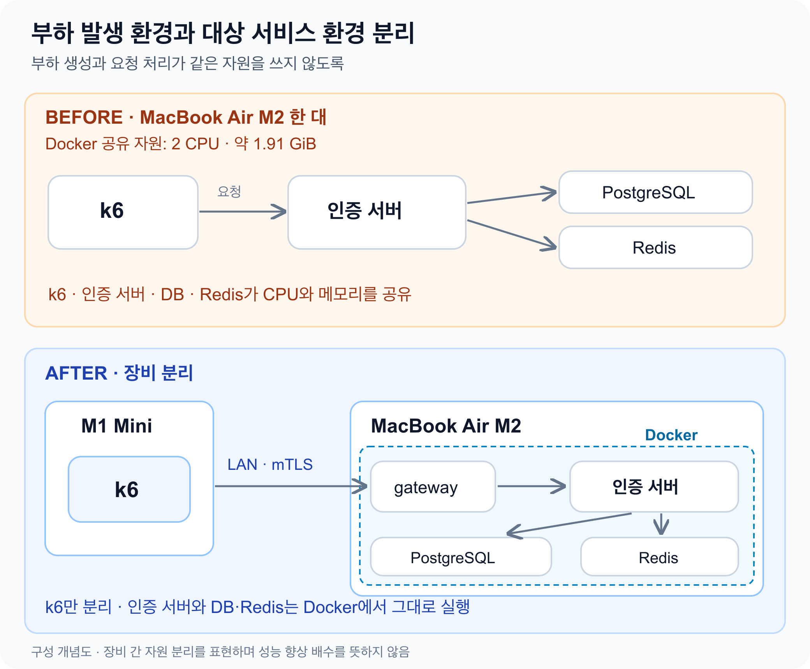

# 서버의 한계인 줄 알았는데 k6가 먼저 죽었다

처음에는 MacBook Air M2 한 대에서 k6와 인증 서버, PostgreSQL, Redis를 모두 실행했다. **200 VU까지는 성공했지만, 300 VU에서는 시험이 중단됐다.**

서버의 한계라고 생각하기 쉬운 상황이었다. 그런데 메모리 부족으로 종료된 쪽은 요청을 받는 서버가 아니라, 요청을 보내는 k6였다.

## 200 VU는 성공, 300 VU는 중단

k6, 인증 서버, PostgreSQL, Redis는 Docker에 할당한 **2 CPU와 약 1.91 GiB 메모리**를 함께 사용했다. 호스트의 전체 사양보다 실제로 나눠 쓰는 자원이 중요했다.

VU는 시나리오를 실행하는 가상 사용자 수다. 이 공유 환경에서 결과는 다음과 같았다.

| 부하 | 장기 시험 결과 |
| --- | --- |
| 200 VU | 30분 완료, 당시 시험 기준 통과 |
| 300 VU | 약 19분 뒤 k6 OOM으로 중단 |

300 VU 시험이 멈췄을 때 인증 서버와 DB, Redis는 실행 중이었다. k6 컨테이너에서는 OOM이 관측됐다.

따라서 이 결과만으로 “서버가 300 VU를 처리하지 못한다”고 판단할 수는 없었다. 먼저 부하를 끝까지 보낼 수 있는 환경이 필요했다.

## 요청을 보내는 장비와 받는 장비를 나눴다

k6만 M1 Mini로 옮겼다. **인증 서버·PostgreSQL·Redis는 MacBook Air M2의 Docker 안에서 그대로 실행**하고, M1 Mini에서 LAN으로 요청을 보냈다.

부하 발생기와 대상 서비스가 같은 CPU·메모리를 두고 경쟁하지 않도록 한 것이다.

## 분리 후에는 300 VU로 30분을 측정했다

분리한 환경에서는 **300 VU를 30분 유지하며 장기 지표를 얻었다.** 350 VU에서도 3분 단기 측정을 진행했다.

**요청은 오류 없이 처리됐고, 30분 측정도 완료했다.**

| 요청 처리 | 300 VU · 30분 결과 |
| --- | ---: |
| 측정 요청 수 | 373,238건 |
| 평균 처리량 | 207.35 RPS |
| 요청 실패율 | 0% |
| 전체 요청 p95 | 1,031.04 ms |
| 전체 요청 p99 | 2,530.24 ms |

RPS는 초당 요청 수이며, 여기서는 요청 수를 30분으로 나눴다. p95·p99는 요청 지연 분포의 95·99번째 백분위수다.

장기 측정을 완료했다는 것이 서버의 최대 성능이나 모든 지연 목표를 확인했다는 뜻은 아니다.

## 부하 발생기도 관측해야 한다

이번 경험의 핵심은 **k6도 병목이 될 수 있으므로 부하 발생 환경과 대상 서비스 환경을 분리해야 한다**는 것이다.

분리했다고 모든 병목이 사라지거나 서버의 최대 성능이 확정되는 것은 아니다. 분리 후에도 k6의 CPU·메모리·네트워크와 대상 서비스를 함께 살펴봐야 한다. [Grafana의 k6 관측 가이드](https://grafana.com/docs/k6/latest/testing-guides/running-large-tests/)도 생성기 자체의 자원 사용을 확인하도록 안내한다.

서버가 얼마나 버티는지 보려면, 먼저 부하를 보내는 쪽이 끝까지 버티는지 확인해야 했다.
