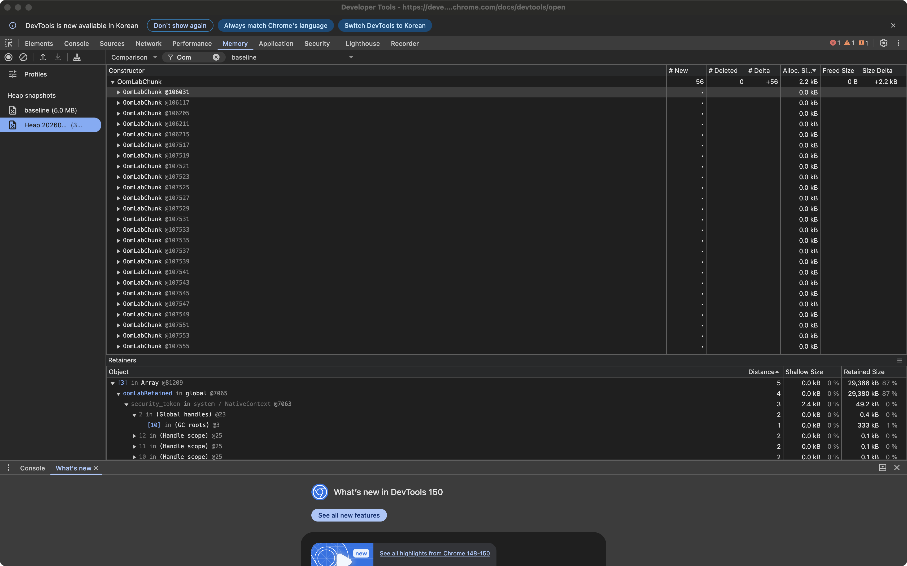

# Node.js OOM을 직접 재현하고, Heap Snapshot으로 원인을 찾기

Node.js 프로세스가 `JavaScript heap out of memory`로 종료됐다. 메모리 한도를 늘리면 당장 다시 실행할 수는 있다. 하지만 어떤 객체가 메모리를 차지했고, 왜 가비지 컬렉터가 회수하지 못했는지는 여전히 알 수 없다.

이 과정을 직접 확인하기 위해 작은 Node.js 프로세스에 의도적으로 객체를 쌓았다. 실행 초기의 **baseline 스냅샷**과 힙 한계에 가까워졌을 때의 **자동 스냅샷**을 만들고, DevTools에서 비교했다.

결과부터 말하면 `OomLabChunk` 객체가 0개에서 56개로 늘었다. 객체 자체의 크기는 합쳐서 약 2.2kB에 불과했지만, 이 객체들을 보관한 배열은 약 29.4MB의 메모리를 붙잡고 있었다. 이번 글은 그 차이를 화면에서 확인하고 참조 경로를 따라가는 기록이다.

> 실험은 Node.js 24.13.1의 별도 로컬 프로세스에서 진행했다. 인증 서버의 실제 누수를 발견한 사례는 아니다. 아래 화면은 Chrome DevTools의 Memory 패널을 직접 캡처한 것이다.

## 1. OOM을 재현할 작은 프로그램 만들기

아래 코드를 `reproduce.cjs`로 저장한다. 실험에 사용한 코드에서 읽기 쉽도록 줄바꿈만 정리했다.

```javascript
const v8 = require('node:v8');

globalThis.oomLabRetained = [];
v8.writeHeapSnapshot('baseline.heapsnapshot');

class OomLabChunk {
  constructor(id) {
    this.id = id;
    this.payload = new Array(65536).fill(id);
  }
}

setInterval(() => {
  for (let i = 0; i < 4; i++) {
    globalThis.oomLabRetained.push(
      new OomLabChunk(globalThis.oomLabRetained.length),
    );
  }

  console.log(
    JSON.stringify({
      chunks: globalThis.oomLabRetained.length,
      ...process.memoryUsage(),
    }),
  );
}, 20);
```

20ms마다 객체 네 개를 만들고 전역 배열에 넣는다. 각 객체에는 숫자 65,536개를 담는 `payload` 배열이 있다. 전역 배열에서 객체를 제거하는 코드는 없다.

의도한 참조 구조는 다음과 같다.

```text
GC root에서 도달 가능한 global
└─ oomLabRetained: Array
   ├─ OomLabChunk
   │  └─ payload: Array(65536)
   ├─ OomLabChunk
   │  └─ payload: Array(65536)
   └─ 계속 추가되는 객체들
```

가비지 컬렉터는 객체가 오래됐다는 이유만으로 지우지 않는다. 이 예제에서는 전역 배열을 통해 객체에 계속 도달할 수 있다. 따라서 `OomLabChunk`와 그 객체가 참조하는 `payload`가 계속 살아남는다.

## 2. 힙 한도를 낮추고 스냅샷 남기기

일반 서비스 프로세스 대신 이 실험용 프로그램만 실행한다. macOS/Linux 셸 기준 명령은 다음과 같다.

```bash
# reproduce.cjs가 있는 실험 전용 디렉터리에서 실행
node --version # 이번 실험: v24.13.1

(
  umask 077
  ulimit -c 0
  node \
    --max-old-space-size=32 \
    --heapsnapshot-near-heap-limit=1 \
    --diagnostic-dir=. \
    reproduce.cjs > oom.log 2>&1
)
```

`--max-old-space-size=32`는 V8 old-space 한도를 32MiB로 설정한다. **프로세스 전체 메모리를 32MiB로 제한하는 옵션은 아니다.** `--heapsnapshot-near-heap-limit=1`은 힙 한계에 가까워지면 자동 스냅샷을 최대 한 개 저장하도록 한다. `--diagnostic-dir`은 그 진단 파일의 저장 디렉터리다. 코드에서 직접 파일명을 지정한 baseline은 현재 작업 디렉터리에 저장된다. 옵션의 의미는 [Node.js 24.13.1 CLI 문서](https://nodejs.org/download/release/v24.13.1/docs/api/cli.html#--heapsnapshot-near-heap-limitmax_count)에서 확인할 수 있다.

이번 실행에서는 다음 파일이 만들어졌다.

```text
baseline.heapsnapshot
Heap.20260906.094454.38528.0.001.heapsnapshot
oom.log
```

로그에는 스냅샷 저장 메시지 이후 다음 오류가 기록됐다.

```text
FATAL ERROR: Reached heap limit Allocation failed - JavaScript heap out of memory
```

실행을 감싼 Python 프로세스에서 확인한 반환 코드는 `-6`, 즉 SIGABRT에 의한 종료였다. 실제 OOM 종료와 스냅샷 생성을 각각 확인한 셈이다.

### 자동 스냅샷은 정확히 종료 순간의 기록이 아니다

이 부분은 실험 결과를 읽을 때 특히 주의해야 한다.

자동 스냅샷에는 `OomLabChunk`가 56개 들어 있었다. 반면 종료 전 마지막 메모리 로그에는 **440개**, `heapUsed`는 **233,662,488 bytes, 약 222.8MiB**로 기록됐다. 초기 설정인 32MiB보다 훨씬 크다.

Node.js는 스냅샷을 생성하는 데 필요한 메모리를 확보하기 위해 힙 한도를 조정할 수 있다. 스냅샷 생성 전후의 GC도 영향을 준다. 따라서 “32MiB를 넘으면 즉시 종료된다”거나 “스냅샷이 마지막 할당 객체까지 담고 있다”고 해석하면 안 된다. 이 글에서 OOM 스냅샷이라고 부르는 파일은 **OOM으로 끝난 실행에서 힙 한계 근처에 생성된 스냅샷**이다. [Node.js의 near-heap-limit 동작 설명](https://nodejs.org/download/release/v24.13.1/docs/api/cli.html#--heapsnapshot-near-heap-limitmax_count)

## 3. DevTools에서 baseline과 비교하기

DevTools의 **Memory** 패널에서 **Load**를 누르거나 빈 프로파일 목록의 우클릭 메뉴를 사용해 파일을 불러온다. 먼저 baseline을, 다음으로 자동 스냅샷을 불러오면 비교 기준을 알아보기 쉽다. 이미 저장된 파일을 분석하므로 종료된 Node.js 프로세스에 다시 연결할 필요는 없다. [Node.js 스냅샷 분석 가이드](https://nodejs.org/learn/diagnostics/memory/using-heap-snapshot)

1. 왼쪽 목록에서 자동 스냅샷을 선택한다.
2. 상단 보기 드롭다운을 `Summary`에서 **Comparison**으로 바꾼다.
3. 비교 대상은 **baseline**으로 선택한다.
4. `Class filter`에 `OomLabChunk`를 입력한다. 아래 화면에서는 `Oom`으로 필터링했다.



_그림 1. 사용 중이던 DevTools의 실제 화면. 위쪽 표에서는 객체 증가량을, 아래 Retainers에서는 선택한 객체를 붙잡는 참조를 확인한다._

표의 첫 행에서 확인한 값은 다음과 같다.

| 항목          | 실제 표시 | 읽는 방법                                |
| ------------- | --------: | ---------------------------------------- |
| `# New`       |        56 | 새로 생겨 스냅샷에 남아 있는 객체        |
| `# Deleted`   |         0 | baseline에는 있었지만 현재는 사라진 객체 |
| `# Delta`     |       +56 | 객체 개수의 순증가                       |
| `Alloc. Size` |  약 2.2kB | 새로 생긴 객체 자체의 크기 합계          |
| `Freed Size`  |        0B | 사라진 객체 자체의 크기 합계             |
| `Size Delta`  | 약 +2.2kB | 객체 자체 크기의 순증가                  |

여기서 `Alloc. Size`는 두 시점 사이에 생성됐다가 이미 사라진 모든 객체의 누적 할당량을 뜻하지 않는다. 스냅샷 비교는 두 시점에 남아 있는 객체를 비교하는 작업이다.

실제 서비스처럼 원인을 모르는 상태에서는 필터를 비우고 `Size Delta`를 내림차순으로 정렬해 큰 증가부터 찾는다. 다만 이번처럼 큰 배열을 붙잡는 객체 자체는 작을 수 있으므로, 작은 `Size Delta`만 보고 조사 대상에서 제외하면 안 된다. [DevTools의 Comparison 설명](https://developer.chrome.com/docs/devtools/memory-problems/heap-snapshots#comparison)

## 4. 2.2kB짜리 객체가 어떻게 수십 MB를 붙잡을까

`OomLabChunk`의 필드는 숫자 `id`와 배열을 가리키는 `payload`다. 객체 자체의 크기와, 이 객체가 살아 있기 때문에 함께 남아 있는 메모리는 다르다.

| 용어              | 의미                                                   | 이번 실험에서의 해석                 |
| ----------------- | ------------------------------------------------------ | ------------------------------------ |
| **Shallow Size**  | 객체 자체가 차지하는 메모리                            | `OomLabChunk` 자체는 작다            |
| **Retained Size** | 그 객체가 도달 불가능해지면 함께 회수될 수 있는 메모리 | 객체에 매달린 `payload`까지 고려한다 |

Retained Size는 모든 자식의 크기를 무조건 더한 값이 아니다. 다른 살아 있는 객체가 공유해서 참조하는 메모리는 특정 객체 하나가 없어져도 회수되지 않을 수 있다. 또한 생성자 그룹 행의 Retained Size와 개별 인스턴스의 값을 구분해야 한다. [DevTools 메모리 용어](https://developer.chrome.com/docs/devtools/memory-problems/get-started)

`Summary`로 전환한 뒤 `OomLabChunk`를 펼치면 인스턴스별 Shallow Size와 Retained Size를 확인할 수 있다. 객체를 더 펼쳐 `payload` 배열을 보면 큰 데이터가 어느 필드에 연결돼 있는지도 확인할 수 있다.

위 캡처만으로도 이 차이가 보인다. 아래 Retainers의 `Array @81209` 행은 **Retained Size 약 29,366kB, 87%**를 표시한다. OomLabChunk의 증가량 약 2.2kB와 함께 읽으면 “작은 객체들을 보관하는 배열이 큰 데이터의 수명을 연장하고 있다”는 구조를 이해할 수 있다.

스냅샷 JSON을 별도로 집계했을 때도 배열의 내부 요소 저장 공간인 `(object elements)` 그룹은 **29,437,648 bytes, 약 28.1MiB**였다. 이 값은 해당 그룹 전체의 Shallow Size 합계이고, 화면의 특정 배열 Retained Size와 집계 대상이 다르다. 화면은 kB/MB, 본문 일부 수치는 MiB로 표시하므로 단위도 구분한다.

## 5. Retainers에서 “누가 붙잡고 있는가” 찾기

Comparison에서 `OomLabChunk`를 펼친 뒤 **인스턴스 한 개**를 선택한다. 아래의 **Retainers** 패널이 그 객체를 참조하는 쪽을 보여준다.

이번 화면의 경로를 읽으면 다음과 같다.

```text
선택한 OomLabChunk @106031
← [3] in Array @81209
← oomLabRetained in global @7065
← ... GC roots
```

이는 “선택한 객체를 배열의 인덱스 3이 참조하고 있고, 그 배열을 전역 객체의 `oomLabRetained` 속성이 참조한다”는 뜻이다. Retainers는 객체 안에 무엇이 들어 있는지를 보는 화면과 방향이 반대다. 선택한 객체에서 자신을 참조하는 부모 쪽으로 올라간다.

`@106031` 같은 값은 객체 식별자다. 다음 실행에서 같은 값이 나올 필요는 없다. `security_token in system / NativeContext` 같은 내부 항목도 보이지만, 이번 원인을 설명하는 애플리케이션 소유 참조는 이미 **`globalThis.oomLabRetained`**에서 찾았다.

이제 원인을 코드와 연결할 수 있다.

```javascript
globalThis.oomLabRetained.push(new OomLabChunk(...));
```

이 배열에는 상한도 없고 제거 정책도 없다. 계속 추가하는 동안 모든 `payload`가 함께 살아남는다. 이것이 이번 OOM의 의도된 원인이다.

## 6. 힙 덤프 파일이 작다고 메모리 사용량도 작은 것은 아니다

이번 파일의 디스크 크기는 baseline 약 **4.57MB**, 자동 스냅샷 약 **4.18MB**였다. 오히려 자동 스냅샷 파일이 조금 더 작다. 하지만 스냅샷 노드의 Shallow Size를 합산하면 다음과 같다.

| 관측 항목                 |        baseline |      자동 스냅샷 |
| ------------------------- | --------------: | ---------------: |
| `OomLabChunk` 인스턴스    |               0 |               56 |
| 노드 Shallow Size 합계    | 4,981,821 bytes | 33,757,829 bytes |
| `.heapsnapshot` 파일 크기 | 4,567,820 bytes |  4,177,232 bytes |

`.heapsnapshot`은 프로세스 메모리를 그대로 복사한 바이너리가 아니라 객체 그래프를 표현하는 데이터다. 숫자 배열의 모든 값이 동일한 방식으로 독립적인 객체 노드가 되는 것도 아니다. 파일 크기로 힙 사용량을 추정하지 말고, DevTools에 표시된 객체 크기와 참조 관계를 읽어야 한다. 노드 크기 합계 역시 RSS나 `process.memoryUsage().heapUsed`와 같은 측정값은 아니다.

## 7. 실제 서비스에 적용할 때의 순서

이번 예제는 원인을 알고 시작했다. 실제 서비스에서는 다음 순서로 범위를 좁힐 수 있다.

1. 초기화와 워밍업이 끝난 시점에 baseline을 남긴다.
2. 같은 요청 시나리오를 일정 횟수 실행한다.
3. 요청과 백그라운드 작업이 정리될 시간을 준 뒤 다음 스냅샷을 남긴다.
4. Comparison으로 증가한 객체를 찾고, Retained Size로 영향도를 확인한다.
5. Retainers로 캐시, 전역 Map, 이벤트 리스너, 타이머 등의 소유 참조를 찾는다.
6. 참조 해제나 보관 상한을 수정한 뒤 같은 실험을 반복한다.

객체가 증가했다는 사실만으로 메모리 누수라고 확정할 수는 없다. 정상적인 캐시 준비나 처리 중인 요청도 객체를 늘린다. 작업이 끝난 뒤에도 살아 있어야 하는 데이터인지, 반복 실행할수록 계속 증가하는지를 함께 확인해야 한다.

또한 V8의 `JavaScript heap out of memory`와 운영체제·컨테이너의 메모리 제한에 의한 종료는 구분해야 한다. RSS에는 JS 힙 외의 메모리도 포함된다. 컨테이너가 먼저 강제 종료되면 near-limit 스냅샷을 남길 기회가 없을 수 있다. 종료 코드, 컨테이너 OOM 상태, RSS, `heapUsed`, `external`, `arrayBuffers`를 함께 봐야 하는 이유다.

스냅샷 생성은 메인 스레드를 멈추고 추가 메모리를 사용할 수 있다. 실제 서비스에서는 중단을 감당할 수 있는 인스턴스에서 수행하고, 덤프에 토큰·비밀번호 같은 런타임 데이터가 포함될 수 있음을 고려해야 한다. [Node.js의 스냅샷 운영 주의사항](https://nodejs.org/learn/diagnostics/memory/using-heap-snapshot)

## 마치며

이번 실험에서 가장 유용했던 것은 큰 숫자 하나가 아니라 세 가지 관측을 연결한 과정이었다.

- **Comparison**: `OomLabChunk`가 56개 증가했다.
- **Retained Size**: 작은 객체를 모은 배열이 약 29.4MB를 붙잡고 있었다.
- **Retainers**: 그 배열의 소유자는 전역 속성 `oomLabRetained`였다.

힙 한도를 늘릴지 결정하기 전에, 무엇이 늘었고 누가 수명을 유지하는지를 확인하면 수정할 코드가 구체적으로 보인다. 이번에는 `push()`만 있고 제거가 없는 전역 배열이 그 지점이었다.
