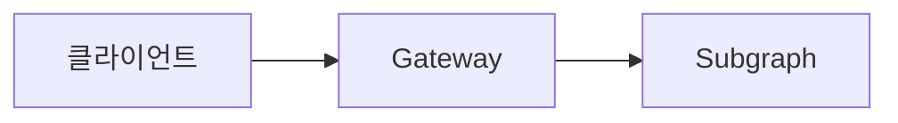

# Study 블로그

학습 폴더의 Markdown과 이미지를 읽어 Astro 정적 블로그를 만듭니다. 공개할 글은 [posts.json](./posts.json)에서 관리하며, 원문을 이 폴더에 복제하지 않습니다.

고정 소개 페이지는 [`src/pages/about.astro`](./src/pages/about.astro)에서 관리합니다. 상단의 About Me 링크와 `/about/`에서 열립니다.

공개 주소는 `https://blog.rvkang.app/`입니다.

## 소개 페이지의 경력 로고

경력 타임라인의 연결선은 [`src/assets/companies/`](./src/assets/companies/)에 저장한 로고를 이어 표시합니다. 더즌 SVG는 [공식 사이트](https://www.dozn.co.kr/img/logo.svg), 캐리버스 아이콘은 [공식 문서](https://s-organization-359.gitbook.io/carrieverse), DeFi on MCW 이미지는 [프로젝트 텔레그램 채널](https://t.me/p2pDeFi)에서 가져왔습니다. 크립토 항목의 이미지는 회사 로고로 확인된 자료가 아니므로 페이지와 대체 텍스트에 DeFi on MCW 서비스 로고임을 표시합니다.

## 소개 페이지의 npm 다운로드 통계

작업물의 npm 패키지 카드에 프로젝트의 관련 패키지를 합산한 누적 다운로드와 npm 집계 기준일을 표시합니다. 현재 rvlog 9개, rv-workflow 1개, nest-batch 8개를 합산합니다. 합산 대상은 [`about.astro`](./src/pages/about.astro)의 `projectPackages`에서 관리하며, 같은 저장소에서 배포하는 패키지를 추가하면 이 목록도 갱신합니다.

개발 페이지를 열거나 정적 빌드를 실행할 때 공개 npm API를 조회하며, 배포된 페이지의 수치는 다음 빌드에서 갱신됩니다. 로컬 개발 중에는 성공한 응답을 1시간, 실패한 응답을 1분 동안 메모리에 보관해 반복 요청을 줄입니다. 인증키와 방문자의 API 요청은 필요하지 않습니다.

[`npm-downloads.mjs`](./src/lib/npm-downloads.mjs)는 패키지 최초 등록일부터 npm의 마지막 집계일까지를 최대 365일씩 나누어 합산합니다. API 통계는 2015-01-10 이후만 제공하며, 현재 합산하는 패키지는 모두 그 이후 등록됐습니다. 동시에 조회하는 패키지는 최대 4개이며, 패키지별 조회 제한 시간은 8초입니다. 관련 패키지 중 하나라도 조회에 실패하거나 기준일이 다르면 부분 합계를 게시하지 않고 해당 카드에 조회 불가 문구를 표시합니다. API 장애가 있어도 빌드는 계속합니다. 다운로드 수는 사용자 수를 의미하지 않습니다.

## 로컬 환경

이 폴더는 Node.js **24.20.0**, npm **11.19.0**, Astro **7.3.1**을 사용합니다. `.nvmrc`, `package.json`, `package-lock.json`을 기준으로 설치하며 다른 학습 폴더의 런타임과 독립적입니다.

저장소 루트에서 시작합니다. nvm과 지정된 Node.js가 설치되어 있어야 합니다.

```sh
cd site
nvm use
node --version
npm --version
npm ci
npm run dev
```

버전 출력은 각각 `v24.20.0`, `11.19.0`이어야 합니다. 개발 서버의 `/`에서 목록과 초안을 확인합니다. 서버를 종료하려면 `Ctrl+C`를 누릅니다.

## 검증과 초안 검토

다음 명령은 모두 `site/`에서 실행합니다.

```sh
npm test
npm run build
npm run build:preview
npm run preview:review
```

| 명령 | 용도 |
| --- | --- |
| `npm test` | 콘텐츠와 경로 처리 검증 |
| `npm run build` | 공개 글만 `dist/`에 생성 |
| `npm run dev` | localhost에서 초안 포함 개발 |
| `npm run build:preview` | 초안 포함 검토 결과를 `dist-preview/`에 생성 |
| `npm run preview:review` | `dist-preview/`를 로컬에서 확인 |

검토 모드는 검색 제외 메타데이터를 제공합니다. `dist-preview/`는 로컬 검토용이며 배포하지 않습니다. OOM 글은 2026-09-06에 공개 대상으로 전환했습니다. `draft: true`인 글과 그 글만 사용하는 이미지는 공개 빌드에서 제외됩니다.

## 글 추가와 수정

1. 주제별 폴더에서 원문 Markdown과 이미지를 작성합니다.
2. `posts.json`에 항목을 추가합니다. `source`는 저장소 루트 기준 경로이며, `title`은 원문의 첫 `# 제목`과 같아야 합니다. 본문에는 두 번째 최상위 제목을 두지 않습니다.
3. `draft: true`, `publishedAt: null`로 두고 로컬에서 제목, 코드, 표, 이미지와 링크를 확인합니다.
4. 발행할 때 `draft`를 `false`로 바꾸고 `publishedAt`에 실제 최초 공개 날짜를 `YYYY-MM-DD`로 기록합니다.
5. 테스트와 공개 빌드를 실행해 결과를 확인한 뒤 배포합니다.

```json
{
  "slug": "nodejs-oom-heap-snapshot",
  "source": "oom-snapshot/blog/index.md",
  "title": "Node.js OOM을 직접 재현하고, Heap Snapshot으로 원인을 찾기",
  "description": "Heap Snapshot 비교로 메모리 참조를 추적한 학습 기록",
  "publishedAt": null,
  "draft": true
}
```

`showToc`는 선택 항목입니다. `false`로 지정한 글은 자동 목차를 숨기며, 생략하면 기존처럼 표시합니다.

### Mermaid 다이어그램

Markdown의 `mermaid` 코드 블록을 다이어그램으로 표시합니다. Mermaid **12.0.0**을 npm 의존성으로 고정하고, 다이어그램이 있는 페이지에서 브라우저 렌더링 모듈을 불러옵니다. 원문은 코드로 관리하며 별도의 이미지 파일은 필요하지 않습니다. [Mermaid 사용 안내](https://mermaid.js.org/config/usage.html)



가로형 다이어그램의 높이는 최대 240px이며, 좁은 화면에서는 글자 크기를 유지하도록 다이어그램 안에서 가로로 스크롤합니다. JavaScript가 비활성화되거나 렌더링이 실패하면 원문 코드가 남습니다. HTML과 클릭 기능은 `securityLevel: strict`로 제한합니다.

공개된 글의 `slug`는 기존 링크를 유지하기 위해 변경하지 않습니다. 원문을 수정하면 다음 빌드에 반영됩니다. 등록한 글과 참조 이미지가 빌드 입력이며, 재현 코드 실행이나 스냅샷 재생성은 필요하지 않습니다. 누락 파일, workspace 밖 경로, 중복 slug와 공개 대상으로 해석할 수 없는 로컬 링크는 오류를 해결한 뒤 다시 빌드합니다.

## GitHub Pages 배포

[배포 workflow](../.github/workflows/deploy-blog.yml)는 `main` push와 수동 실행에서 설치·테스트·공개 빌드를 수행한 뒤 **`site/dist/`만** 배포합니다. PR은 테스트와 빌드만 수행합니다. 글과 이미지 변경도 빌드 대상이 되도록 경로 필터를 두지 않았습니다.

실제 발행을 진행할 때 저장소의 **Settings → Pages → Build and deployment → Source**를 **GitHub Actions**로 선택합니다. 이후 `main`에 반영하거나 Actions에서 workflow를 실행하고 성공 여부와 공개 주소를 확인합니다. 수동 실행도 `main`에서만 배포합니다. [Astro 공식 배포 안내](https://docs.astro.build/en/guides/deploy/github/)

## SEO 기본 설정과 검색 등록

검색 메타데이터는 [`Seo.astro`](./src/components/Seo.astro)에서 생성합니다. 공개 글의 `posts.json`에 등록된 제목·요약·발행일과 원문 이미지를 사용하며, 빌드 날짜를 글의 수정일로 만들지 않습니다.

| 설정 | 동작 |
| --- | --- |
| 제목·설명·언어 | 페이지별 title과 description, 한국어 언어 정보 |
| canonical | UTM 등 쿼리 문자열을 제외한 원본 URL |
| 구조화 데이터 | 글의 `BlogPosting`에 제목·설명·작성자·실제 발행일·본문 이미지, 하위 페이지에 `BreadcrumbList` |
| 공유 카드 | Open Graph와 Twitter 카드. 본문의 첫 이미지, 이미지가 없으면 작성자 프로필 이미지 사용 |
| 검색 허용 | 공개 페이지는 `index, follow, max-image-preview:large` |
| 초안 보호 | 미리보기는 `noindex, nofollow`, canonical·구조화 데이터·소유권 확인 태그 제외 |
| 사이트맵 | 공개 글·홈·소개 페이지의 절대 URL만 포함 |

구조화 데이터의 글 이미지는 실제 본문 이미지가 있을 때만 기록합니다. 공유 카드의 기본 프로필 이미지를 글의 대표 이미지로 구조화 데이터에 넣지는 않습니다. 글의 정확한 수정일은 현재 관리하지 않으므로 `dateModified`와 사이트맵 `lastmod`를 생략합니다. 제목과 요약은 글 내용을 구체적으로 설명하도록 작성하고 공개 slug를 유지하세요. [Google Article 구조화 데이터 안내](https://developers.google.com/search/docs/appearance/structured-data/article)

### Google Search Console 연결

1. [Google Search Console](https://search.google.com/search-console/)에서 **URL 접두어** 속성 `https://blog.rvkang.app/`를 추가합니다.
2. 소유권 확인 방법으로 **HTML 태그**를 선택합니다. 제공된 `<meta name="google-site-verification" content="...">`에서 `content` 값만 복사합니다.
3. GitHub 저장소의 **Settings → Secrets and variables → Actions → Variables**에 `PUBLIC_GOOGLE_SITE_VERIFICATION` 이름으로 값을 등록합니다. 전체 HTML 태그를 넣지 않습니다. 로컬 빌드 확인은 `site/.env`에 같은 변수를 지정합니다.
4. 코드 변경을 `main`에 반영한 뒤 배포 workflow를 실행합니다. 공개 홈의 소스에 확인 태그가 있는지 확인하고 Search Console에서 **확인**을 누릅니다. 확인 후에도 변수와 태그를 유지합니다.
5. **Sitemaps**에 `https://blog.rvkang.app/sitemap.xml`을 제출합니다. **URL 검사**에서 공개 글의 수집 상태를 확인하고 필요하면 색인 생성을 요청합니다.
6. [리치 결과 테스트](https://search.google.com/test/rich-results)에 공개 글 URL을 넣어 구조화 데이터를 확인합니다. 본문 이미지가 없는 글은 이미지 관련 권장사항이 남을 수 있습니다.

소유권 확인 코드는 GA4 측정 ID와 별개입니다. 코드를 설정하지 않아도 기본 SEO 메타데이터는 생성됩니다. 검색 계정 등록과 사이트맵 제출은 계정에서 직접 진행해야 하며, 태그·사이트맵·구조화 데이터는 검색 노출이나 순위를 보장하지 않습니다. [Google 소유권 확인 안내](https://support.google.com/webmasters/answer/9008080?hl=ko), [Google 사이트맵 안내](https://developers.google.com/search/docs/crawling-indexing/sitemaps/build-sitemap)

### 개인 도메인과 이전 링크

GitHub 저장소의 **Settings → Pages → Custom domain**은 `blog.rvkang.app`으로 설정합니다. 공개 사이트의 루트는 `/`이며, robots.txt와 사이트맵은 각각 `https://blog.rvkang.app/robots.txt`, `https://blog.rvkang.app/sitemap.xml`에 배포됩니다. robots.txt의 Sitemap 항목도 같은 도메인을 가리킵니다.

이전 `https://kangjuhyup.github.io/study/` 링크는 GitHub Pages가 개인 도메인으로 이동시킵니다. 개인 도메인에 남은 `/study/`, `/study/about/`, `/study/posts/글-slug/` 링크도 새 경로로 이동하는 정적 페이지를 생성합니다. 이 페이지들은 검색 대상에서 제외하고 사이트맵에도 넣지 않습니다. JavaScript 이동은 공유 링크의 쿼리 문자열과 본문 앵커를 유지하며, JavaScript가 꺼져 있으면 기본 새 경로로 이동합니다.

Cloudflare 프록시를 사용하는 경우 GitHub의 HTTPS 인증서 발급과 Cloudflare의 HTTPS 응답은 별개입니다. HTTP 요청이 HTTPS로 이동하는지도 확인하세요. 다른 서비스에 영향을 주지 않도록 블로그 호스트만 대상으로 HTTPS 이동 규칙을 적용할 수 있습니다.

향후 도메인을 바꿀 때는 [`settings.mjs`](./src/lib/settings.mjs)의 `site.origin`과 `site.base`를 실제 URL에 맞게 수정하고, Search Console 속성·사이트맵과 GA4 웹 스트림 URL도 확인합니다. 이 값은 canonical·구조화 데이터·내부 경로와 방문 통계의 공개 호스트 검사에 사용됩니다.

## 방문 통계, 글별 조회수와 유입 경로 (GA4)

공개 페이지의 공통 레이아웃에 GA4를 연결합니다. 측정 ID를 설정하지 않으면 분석 스크립트를 포함하지 않습니다. 개발 서버와 초안 미리보기는 수집하지 않으며, 공개 빌드도 `https://blog.rvkang.app/`에서 열릴 때만 Google 태그를 불러옵니다. 블로그 안에 통계 화면을 공개하지 않고 본인의 Google Analytics 계정에서 확인합니다.

### 처음 연결하기

1. [Google Analytics](https://analytics.google.com/)에서 GA4 속성을 만들고 **관리 → 데이터 스트림 → 웹**을 선택합니다. 웹사이트 URL은 `https://blog.rvkang.app/`로 지정합니다.
2. 웹 스트림 상세 화면에서 `G-`로 시작하는 **측정 ID**를 복사합니다. 속성 ID나 `GTM-`으로 시작하는 태그 관리자 ID와 다릅니다.
3. GitHub 저장소의 **Settings → Secrets and variables → Actions → Variables → New repository variable**에서 이름을 `PUBLIC_GA_MEASUREMENT_ID`, 값을 복사한 측정 ID로 등록합니다. 같은 이름으로 **Secrets → New repository secret**에 등록해도 배포 workflow가 읽습니다. 두 곳 모두 설정하면 Variables 값을 우선합니다. 측정 ID는 공개 HTML에 포함되는 식별자이며 비밀키가 아닙니다.
4. **Actions → Build and deploy study blog → Run workflow**에서 `main`을 선택해 다시 배포합니다. 변수 변경만으로 기존 배포가 바뀌지는 않습니다.
5. 공개 블로그를 열고 GA4의 **실시간** 보고서에서 방문이 들어오는지 확인합니다. 일반 보고서에는 처리 시간이 필요합니다.

로컬에서 태그가 포함된 빌드를 확인하려면 `site/.env.example`을 `site/.env`로 복사하고 측정 ID를 입력한 뒤 `npm run build`를 실행합니다. `.env`는 커밋하지 않습니다. localhost에서 결과를 열어도 통계는 전송하지 않습니다. 수집을 중단하려면 GitHub Actions 변수를 비우거나 삭제한 뒤 다시 배포합니다.

### 어디를 통해 들어왔는지 확인하기

GA4의 **보고서 → 획득 → 트래픽 획득**에서 **세션 소스/매체**를 선택합니다. 보고서 모음에 따라 획득 메뉴는 비즈니스 목표 아래에 표시될 수 있습니다. 검색 유입, 다른 사이트의 링크와 SNS 유입을 비교하고 **방문 페이지 + 쿼리 문자열**을 보조 측정기준으로 추가하면 어떤 글로 들어왔는지도 확인할 수 있습니다. [Google 트래픽 획득 보고서 안내](https://support.google.com/analytics/answer/12923437?hl=ko)

주소 직접 입력·북마크뿐 아니라 앱이나 브라우저가 출처를 전달하지 않는 방문도 `(direct) / (none)`으로 나타날 수 있습니다. 모든 방문의 출처를 복원하거나 검색어를 알아낼 수 있는 것은 아닙니다. 수집 시작 전 방문 기록은 소급해서 생성되지 않으며, 태그를 차단한 방문은 집계에서 빠질 수 있습니다.

### 어떤 글을 몇 명이 봤는지 확인하기

공통 레이아웃의 Google 태그는 글을 열 때 `page_view`를 자동으로 수집하며 페이지 주소와 제목도 기록합니다. 별도의 조회 이벤트를 추가하지 않습니다. 수동 `page_view`를 함께 보내면 조회수가 중복될 수 있습니다. [Google 페이지 조회 수집 안내](https://developers.google.com/analytics/devguides/collection/ga4/views)

GA4의 **보고서 → 참여도 → 페이지 및 화면**에서 기간을 선택하고, 측정기준을 **페이지 경로 및 화면 클래스**로 바꿉니다. `/posts/`로 시작하는 경로만 포함하도록 필터를 적용하면 홈과 소개 페이지를 제외하고 글별 통계를 볼 수 있습니다. **페이지 제목 및 화면 클래스**로 바꾸면 글 제목으로 확인할 수 있으며, 제목을 수정한 글을 합산할 때는 경로를 기준으로 봅니다. 쿼리 문자열을 포함하지 않는 경로를 사용하면 UTM이 다른 공유 링크도 같은 글로 묶입니다. [Google 페이지 및 화면 보고서 안내](https://support.google.com/analytics/answer/12926732?hl=ko)

| 지표 | 의미 |
| --- | --- |
| 조회수 | 글 페이지가 열린 횟수. 같은 사용자의 재방문과 새로고침도 포함 |
| 총 사용자 | 선택한 기간에 그 글에서 이벤트를 발생시킨 중복 제거 사용자 수 |
| 활성 사용자 | GA4의 참여 조건을 충족한 사용자 수. 총 사용자와 다를 수 있음 |

기본 보고서에는 **활성 사용자**가 표시됩니다. 글을 연 전체 사용자 수를 보려면 **탐색 → 자유 형식**에서 행에 **페이지 경로 및 화면 클래스**, 값에 **조회수**와 **총 사용자**를 추가하고, **이벤트 이름 = `page_view`**, **페이지 경로 및 화면 클래스가 `/posts/`로 시작**하는 필터를 적용합니다. 예를 들어 GA4가 구분한 사용자 10명이 같은 글을 각각 두 번 열었다면 조회수는 20회, 총 사용자는 10명입니다. [Google 사용자 지표 안내](https://support.google.com/analytics/answer/12253918?hl=ko)

이 블로그에는 로그인 기반 사용자 식별이 없으므로 사용자 수는 브라우저 식별자에 기반한 추정치입니다. 같은 사람이 다른 기기·브라우저를 쓰거나 쿠키를 삭제하면 여러 사용자로 잡힐 수 있습니다. 글별 사용자 수를 더해도 블로그 전체 사용자 수와 같지는 않습니다. 한 사용자가 여러 글을 읽을 수 있기 때문입니다. [Google 사용자 식별 안내](https://support.google.com/analytics/answer/10976610?hl=ko)

### Medium과 SNS에 공유할 링크

공유 링크에 `utm_source`, `utm_medium`, `utm_campaign`을 붙이면 출처가 전달되지 않아도 지정한 유입 경로를 기록할 수 있습니다. 아래 링크의 `/`를 공유할 글 경로로 바꿔 사용하세요.

| 공유 위치 | 링크 예시 |
| --- | --- |
| Medium 글의 원문 링크 | `https://blog.rvkang.app/?utm_source=medium&utm_medium=referral&utm_campaign=study_share` |
| LinkedIn 게시물 | `https://blog.rvkang.app/?utm_source=linkedin&utm_medium=social&utm_campaign=study_share` |
| 카카오톡 공유 | `https://blog.rvkang.app/?utm_source=kakaotalk&utm_medium=social&utm_campaign=study_share` |

GA4에서 세션 소스/매체와 세션 캠페인으로 비교합니다. UTM은 공유한 링크의 표식이므로 링크를 다른 곳에 재공유해도 원래 지정한 출처로 기록될 수 있습니다. 블로그 내부 링크, sitemap과 canonical에는 UTM을 붙이지 않습니다. [Google GA4 UTM 안내](https://support.google.com/analytics/answer/11242870?hl=ko)

### 이력서에 넣을 링크

이력서에는 `https://blog.rvkang.app/cv/`를 사용합니다. 블로그 홈과 같은 화면을 제공하며, URL에 UTM을 붙이지 않고 Google 태그의 `campaign_source: resume`, `campaign_medium: referral`, `campaign_name: portfolio`를 설정합니다. GA4의 세션 소스/매체에서 이력서용 링크 유입을 구분할 수 있습니다. 검색 결과에 이 경로가 노출되지 않도록 `noindex, follow`를 설정하고 사이트맵에서 제외하며, canonical은 홈 주소를 유지합니다. 일반 홈·소개·글 페이지의 출처는 덮어쓰지 않습니다. [Google 캠페인 설정 문서](https://developers.google.com/analytics/devguides/collection/ga4/reference/config#campaign_source)

이 경로는 개인별 식별자가 아닌 링크의 출처를 표시합니다. 다른 곳에 재공유하면 이력서용 링크 유입으로 기록될 수 있으며, 기존 세션 도중 유입된 클릭은 세션의 최초 출처와 다르게 표시될 수 있습니다. JavaScript나 Google 태그를 차단한 방문은 집계되지 않습니다.

## GitHub 이슈 댓글

공개 글 하단에 [utterances](https://utteranc.es/)를 표시합니다. `kangjuhyup/study`의 Issues에 도메인 이전 전의 `/study/posts/글-slug/`를 고정 `issue-term`으로 사용하므로 도메인과 제목 수정은 댓글 연결에 영향을 주지 않습니다. 기존 글의 slug는 유지하세요.

저장소는 공개 상태와 Issues 활성화가 필요하며, [utterances GitHub App](https://github.com/apps/utterances)을 해당 저장소에 설치해야 합니다. 첫 댓글이 작성되면 연결할 이슈가 자동 생성됩니다. 댓글 작성자는 GitHub 로그인과 앱 승인이 필요합니다. 미리보기와 초안에는 위젯을 불러오지 않습니다.

## Medium에도 올리기

1. Astro 글을 공개하고 원본 URL이 정상적으로 열리는지 확인합니다.
2. Medium의 **Import a story**에 공개된 원본 URL을 입력합니다.
3. 가져온 제목, 코드, 표, 이미지와 링크를 원문과 비교합니다.
4. Medium 글 설정에서 canonical이 Astro 원본 URL을 가리키는지 확인합니다.
5. Medium에서 최종 확인 후 직접 발행합니다.

가져오기 기능은 원본 canonical을 설정합니다. 가져오기가 실패하면 본문을 수동으로 옮기고 canonical도 직접 확인합니다. Medium은 자동 동기화되지 않으므로, 이후 변경은 Astro 원문에 먼저 반영하고 Medium 사본을 별도로 수정합니다. [Medium 가져오기 안내](https://help.medium.com/hc/en-us/articles/214550207-Importing-a-post-to-Medium)

설계와 보존 범위는 [구현 명세](../docs/specs/2026-09-06-astro-medium-blog.md)를 참고하세요.
